# Lesson: Digital Storytelling

### First and Last Name: Ευστράτιος Κουτουλάκης
### University Registration Number: dpsd19061
### GitHub Personal Profile: [Profile](https://github.com/dpsd19061)
### Digital-Storytelling-Individual-Assignment: [Repository](https://github.com/dpsd19061/Digital-Storytelling-Individual-Assignment)

# Introduction

# Summary

# 1st Deliverable

## Unit 2 - Creative Challenge

### Κτίρια

--> Αρχικά κατασκεύασα 4 διαφορετικά σε σχήμα σπίτια. Στη συνέχεια κατασκεύασα έναν εγκαταλελειμμένο στάβλο όπου θα συμβαίνουν κάποια σημαντικά γεγονότα στην ιστορία μου.

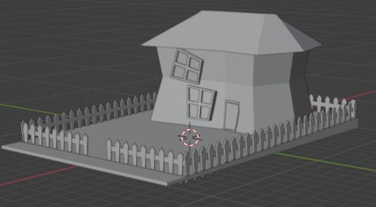
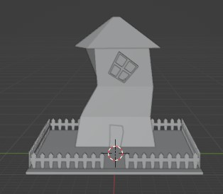
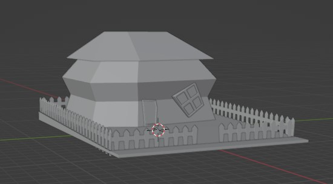
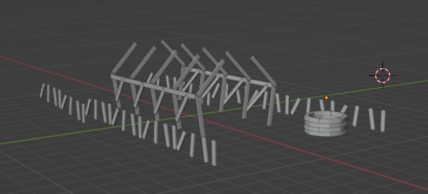

### Βackground - middleground - foreground 

--> Το foreground αποτελείται από τα κτίρια που κατασκευάστηκαν. Εχουν τοποθετηθεί με τέτοιο τρόπο στον χώρο ετσι ώστε να δημιουργούν μια πόλη μαζί με έναν μακρύ και ευθύ δρόμο. Παρακάτω φαίνεται στο τελικό αποτέλεσμα.

--> Το midground αποτελείται από ένα έδαφος σε έκταση 1 x 2 χιλιόμετρα στο οποίο έχω εξωθήσει κάποια σημεία του ετσι ώστε να μοιάζουν με λόφοι.

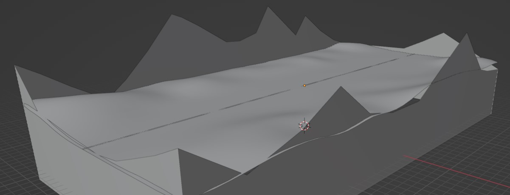

--> Το background ειναι κάποια flat βουνα που επίσης σχεδίασα. Για να τα κανω να φαίνονται σαν βουνά στον ορίζοντα, έχω προσθέσει ενα ημι-διαφανές material.

### Materials

--> Για να δώσω ζωή σε όλη μου τη σκηνή μου έφτιαξα αρκετά παραπάνω materials απο το ζητούμενο. Σε κάποια materials έχω χρησιμοποιήσει φωτογραφίες για να βάλω κάποια textures

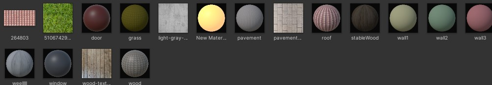

### Directional Light

--> Τέλος άλλαξα τις τιμές του directional light ετσι ώστε η σκηνή να βρίσκεται στο ηλιοβασίλεμα.

### Τελικό αποτέλεσμα:

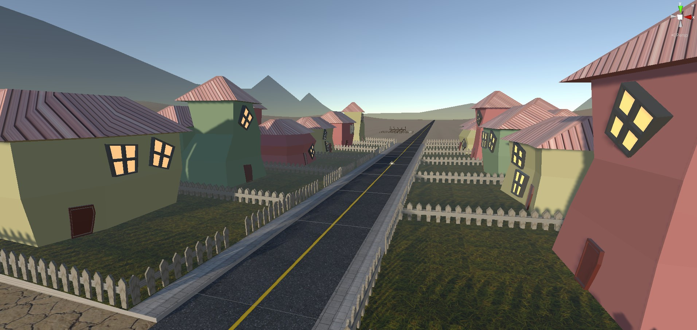

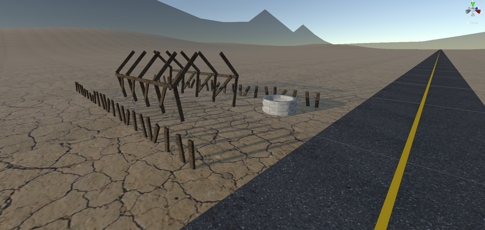

## Unit 3 - Creative Challenge

### Props

--> Σχεδίασα στο Blender τα εξής props: 
+ Ένα αυτοκίνητο πόλης, 
+ Μια μηλιά
+ Ένα κυπαρίσι
+ Έναν κάκτο
+ Εναν θάμνο
+ Μια λάμπα δρόμου
+ Τον πρωταγωνιστή
+ Το αυτοκίνητο του πρωταγωνιστή
+ Ένα μαχαίρι
+ Ένα κέρμα
+ Μια ταμπέλα

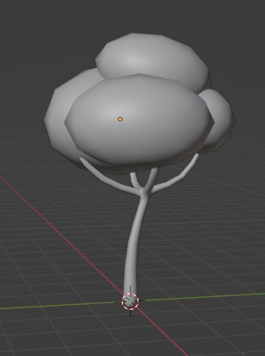
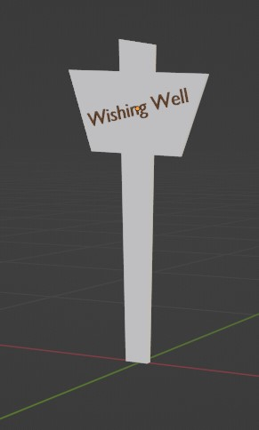
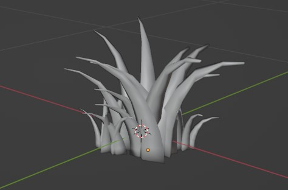
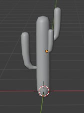
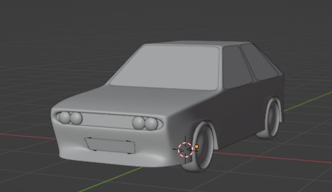
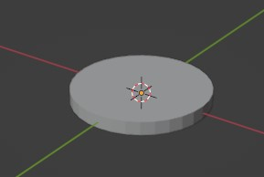
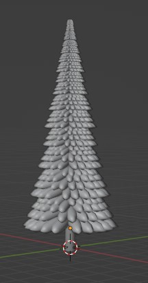
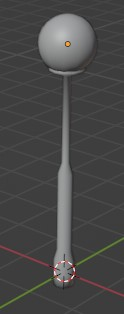
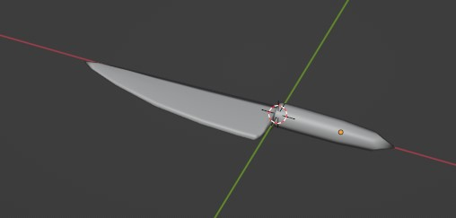
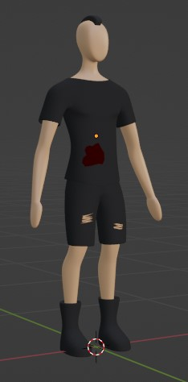
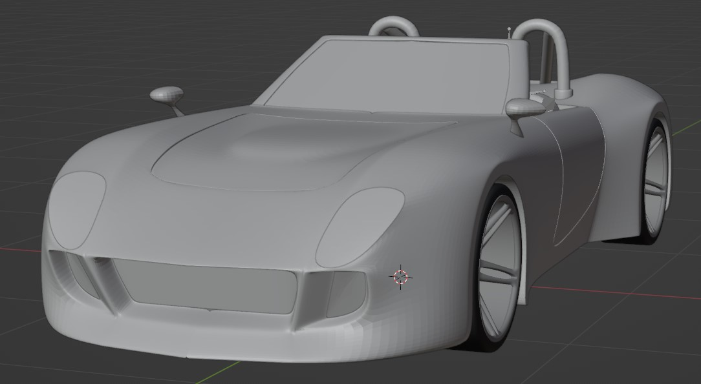

--> Τα τοποθέτησα όλα στη σκηνή μου και αυτό ειναι το τελικό αποτέλεσμα

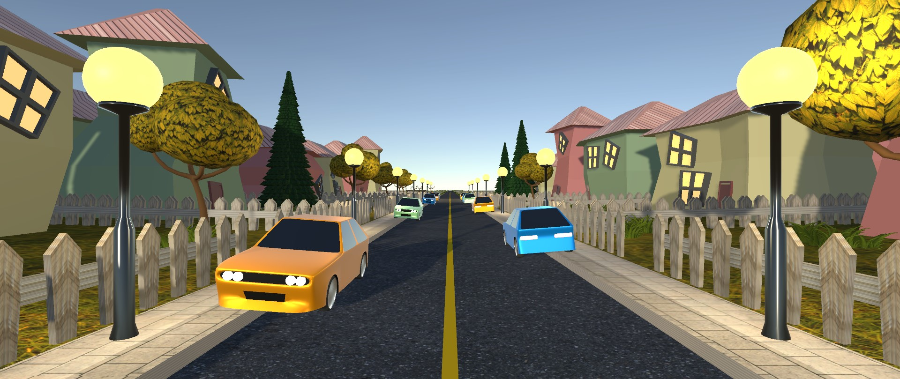

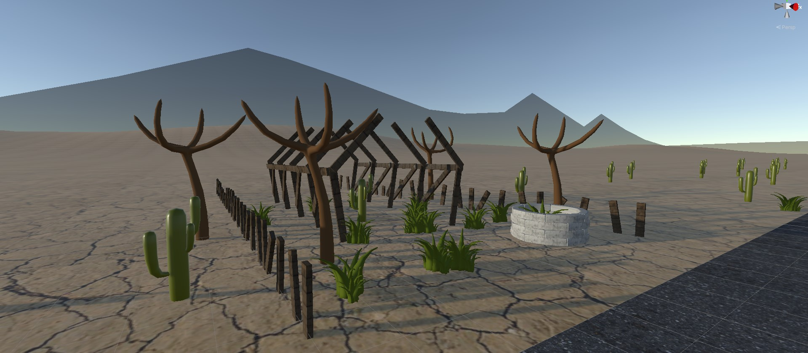

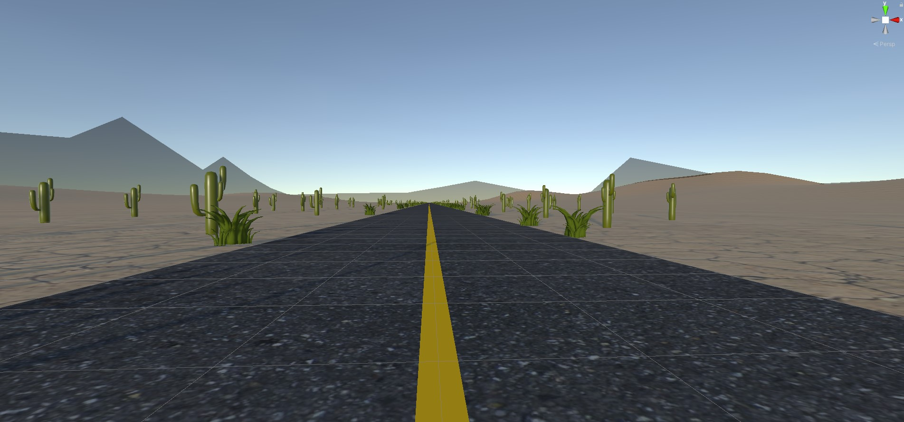

Fun Fact: Μέσα στην σκηνή τοποθέτησα πανω απο 500 θάμνους και 300 κάκτους

## Unit 4 - Creative Challenge

### Animations

--> Τέλος έκανα δύο αυτοκίνητα να μετακινούνται στον δρόμο και έβαλα ένα απλό animation στον πρωταγωνιστή μέσω του [mixamo](). [Εδώ]() φαίνεται το αποτέλεσμα

# 2nd Deliverable

## Unit 5 - Creative Challenge

## Unit 6 - Creative Challenge

## Unit 7 - Creative Challenge

# 3rd Deliverable 

# Conclusions

# Sources
