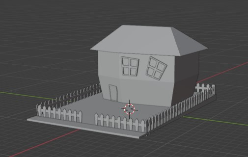
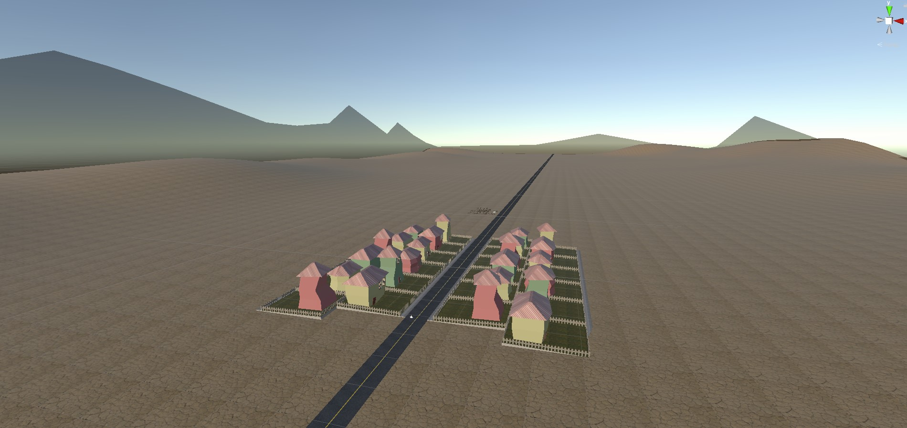

# Lesson: Digital Storytelling

### First and Last Name: Ευστράτιος Κουτουλάκης
### University Registration Number: dpsd19061
### GitHub Personal Profile: [Profile](https://github.com/dpsd19061)
### Digital-Storytelling-Individual-Assignment: [Repository](https://github.com/dpsd19061/Digital-Storytelling-Individual-Assignment)

# Introduction

--> Εργασία για το μάθημα Ψηφιακές Μορφές Αφηγησης που αφορά την δημιουργία animation στο Unity.

# Summary

--> Στην παρακάτω αναφορά παρατίθεται η διαδικασία παραγωγής του τελικού animation στο unity. Αρχικά δημιουργούνται όλα τα assets και τοποθετύνται στη σκηνή. Στη συνέχεια δινεται έμφαση στον φωτισμό και στην ωραιοποίηση της εικόνας. Τέλος Δημιουργείται το animation.

# 1st Deliverable

## Unit 2 - Creative Challenge

### Κτίρια

--> Αρχικά κατασκεύασα 4 διαφορετικά σε σχήμα σπίτια. Στη συνέχεια κατασκεύασα έναν εγκαταλελειμμένο στάβλο όπου θα συμβαίνουν κάποια σημαντικά γεγονότα στην ιστορία μου.

### Βackground - middleground - foreground 

--> Το foreground αποτελείται από τα κτίρια που κατασκευάστηκαν. Εχουν τοποθετηθεί με τέτοιο τρόπο στον χώρο ετσι ώστε να δημιουργούν μια πόλη μαζί με έναν μακρύ και ευθύ δρόμο. Παρακάτω φαίνεται στο τελικό αποτέλεσμα.

--> Το midground αποτελείται από ένα έδαφος σε έκταση 1 x 2 χιλιόμετρα στο οποίο έχω εξωθήσει κάποια σημεία του ετσι ώστε να μοιάζουν με λόφοι.

--> Το background ειναι κάποια flat βουνα που επίσης σχεδίασα. Για να τα κανω να φαίνονται σαν βουνά στον ορίζοντα, έχω προσθέσει ενα ημι-διαφανές material.

### Materials

--> Για να δώσω ζωή σε όλη μου τη σκηνή μου έφτιαξα αρκετά παραπάνω materials απο το ζητούμενο. Σε κάποια materials έχω χρησιμοποιήσει φωτογραφίες για να βάλω κάποια textures

### Directional Light

--> Τέλος άλλαξα τις τιμές του directional light ετσι ώστε η σκηνή να βρίσκεται στο ηλιοβασίλεμα.

### Τελικό αποτέλεσμα:

## Unit 3 - Creative Challenge

### Props

--> Σχεδίασα στο Blender τα εξής props: 
+ Ένα αυτοκίνητο πόλης, 
+ Μια μηλιά
+ Ένα κυπαρίσι
+ Έναν κάκτο
+ Εναν θάμνο
+ Μια λάμπα δρόμου
+ Τον πρωταγωνιστή
+ Το αυτοκίνητο του πρωταγωνιστή
+ Ένα μαχαίρι
+ Ένα κέρμα
+ Μια ταμπέλα

--> Τα τοποθέτησα όλα στη σκηνή μου και αυτό ειναι το τελικό αποτέλεσμα

Fun Fact: Μέσα στην σκηνή τοποθέτησα πανω απο 500 θάμνους και 300 κάκτους

## Unit 4 - Creative Challenge

### Animations

--> Τέλος έκανα δύο αυτοκίνητα να μετακινούνται στον δρόμο και έβαλα ένα απλό animation στον πρωταγωνιστή μέσω του [mixamo](https://www.mixamo.com/#/). [Εδώ](https://github.com/dpsd19061/Digital-Storytelling-Individual-Assignment/tree/main/dailies/Deliverable1/Unit4) φαίνεται το αποτέλεσμα

# 2nd Deliverable

## Unit 5 - Creative Challenge

--> Αυτό το creative challenge ήταν αρκετά απλό. Ακολούθησα πιστά το tutorial, τοποθέτησα τρεις διαφορετικές κάμερες με animation και δύο από αυτές τις έκανα blend. Κατά κύριο κανόνα τα επερχόμενα challenges είναι απλά διότι το μόνο που χρειάστηκε είναι απλά να ακολουθώ τα tutorial και να αλλάζω με τέτοιο τρόπο τις ρυθμίσεις έτσι ώστε να ταιριάζει με το δικό μου animation.

## Unit 6 - Creative Challenge

--> Στο creative challenge 6 έφτιαξα καλύτερα το φωτισμό, ρύθμισα το color grading με βάση τις επιθυμίες μου, έβαλα μπλουμ, ομίχλη και τέλος έβαλα ξεχωριστά σε κάθε κάμερα κατάλληλο depth of field και ένα ελαφρύ vignette.

## Unit 7 - Creative Challenge

--> Τέλος στο creative challenge 7, με particle system έφτιαξα σπίθες και τις τοποθέτησα σε μία λάμπα, και καπνό που βγαίνει από μία καμινάδα. Επιπλέον έβαλα έναν ambient ήχο να ακούγεται καθ'όλη τη διάρκεια του βίντεο.

# 3rd Deliverable 

--> Το τελικό animation δεν ήταν τίποτα παρά την εφαρμογή όλων των γνώσεων από τα προηγούμενα tutorials.

--> Αρχικά έχραψα ένα πρόχειρο σενάριο για να οριστικοποιήσω μια πλοκή.

--> Στη συνέχεια ασχολήθηκα με το animation με τη βοήθεια του [mixamo](https://www.mixamo.com/#/). Παράλληλα δούλευα και το animation των καμερών. Πολλές από τις κάμερες έγιναν child του πρωταγωνιστή και του αυτοκινήτου ετσι ώστε να τους ακολουθούν συνέχεια. Μαλιστα σε ένα συγκεκριμένο πλάνο του αυτοκινήτου, που η κάμερα κάνει orbit γυρω από το αυτοκίνητο έγινε ως εξής: Δημιούργησα ένα empty object ως child του αυτοκινήτου και μεσα στο empty object εβαλα ως child την κάμερα. Μετά, πολύ απλα έκανα animate το empty object ώστε να περιστρέφεται.

--> Τέλος, εφοσον είχα τελειώσει όλο το animation στο unity έκανα export το βιντεο σε mp4 και μετά το έβαλα σε ένα άλλο πρόγραμμα για video editing, το DaVinchi Resolve. Εκεί πρόσθεσα τον τίτλο, την μουσική και τις σκέψεις του πρωταγωνιστή. Το τελευταίο animation που παίζει στα credits έχει γίνει με το Blender.

# Conclusions

Το τελικό animation ως αποτέλεσμα βγήκε ικανοποιητικό, είχε ενδιαφέρον το γεγονος οτι με ένα game engine σαν το unity μπορείς να παράξεις animation τέτοιας ποιότητας. Επιπλέον είχε πολύ ενδιαφέρον που μου δόθηκε η δυνατότητα να σχεδιάσω έναν ολόκληρο κόσμο σε 3D.

# Sources

[Mixamo](https://www.mixamo.com/#/)

Δεν υπαρχουν άλλες πηγές διοτι όλα τα 3D assets ειναι φτιαγμένα από εμένα και δεν χρειάστεικε να ψάξω άλλες πηγές πέρα από τα tutorials που μου παρείχε ο καθηγητής.
